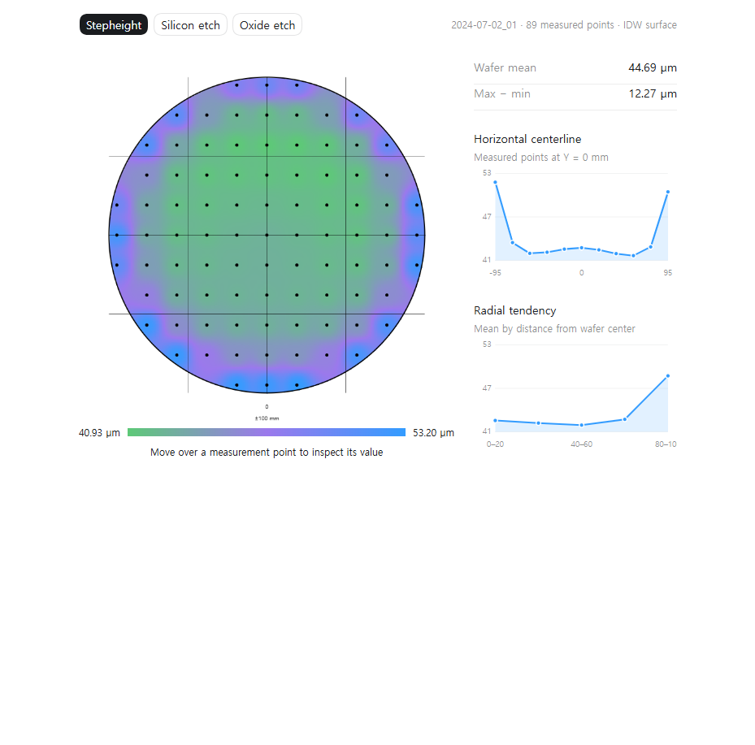

# ETCH-GATE

**Lot-aware virtual metrology and failure-aware measurement selection for
BOSCH plasma etching**

This project asks two connected inspection and metrology questions:

> Can in-situ process traces predict an unseen lot's 89-point wafer stepheight
> map, and can they identify predictions that should be verified by direct
> metrology?

The project uses a 2025 public BOSCH deep-silicon-etch dataset from TU Chemnitz
and Fraunhofer ENAS. Dense P-17 stepheight measurements are hidden from every
held-out lot until final evaluation.

<p align="center">
  
</p>

## At A Glance

| Question | Answer |
|---|---|
| Process | 100-cycle SF6/C4F8 BOSCH plasma etch on 200 mm silicon wafers |
| Available data | 96 process wafers in 10 lots; 88 wafers have direct 89-point P-17 stepheight maps |
| Model input | 31 common in-situ process signals converted to 310 cycle-aware features |
| Prediction target | 89-point post-etch stepheight map |
| Evaluation | Nested leave-one-lot-out; each lot is tested by a model that never saw that lot's stepheight |
| Spatial baseline | Coordinate template fitted using other lots only |
| Main model | Partial Least Squares regression for wafer mean shift and residual map shape |
| Prediction result | MAE `0.3520 -> 0.1435 um`, a 59.2% reduction over the strict template |
| Failure-ranking result | Retained-risk AUC `0.13968 -> 0.12340`, 11.7% below repeated Random |
| Important limitation | At 10%-30% measurement budgets, improvement is only 2.6%-6.3% |
| OES status | Raw OES exists in the release but has not yet been downloaded or used |

## Headline Prediction Result

The repeated coordinate geometry is an unusually strong baseline: a template
fitted only on other lots explains `98.26%` of raw stepheight-map variation.
Raw-map R2 is therefore not used as the headline metric. The useful question is
whether process traces predict the wafer-to-wafer mean shift and residual shape
that the template cannot know.

| Method | Wafer-mean MAE | Lot-macro MAE |
|---|---:|---:|
| Other-lot coordinate template | 0.3520 um | 0.3509 um |
| PLS with predicted mean shift | 0.1591 um | 0.1559 um |
| PLS with predicted mean and residual shape | **0.1435 um** | **0.1399 um** |
| Ridge with predicted mean and residual shape | 0.1533 um | 0.1528 um |

The full PLS model improves nine of ten held-out lots over the template and all
ten over the mean-shift-only stage. Its 59.2% MAE reduction has a lot-cluster
bootstrap 95% interval of 43.8%-68.3%.

<p align="center">
  
</p>

## Data And Measurement Meaning

The source dataset contains:

```text
96 wafers with 31 common process signals sampled at 5 Hz
88 wafers with 89 direct P-17 stepheight measurements
7,832 direct stepheight target values in total
10 chronological process lots
3,648 OES wavelength channels sampled at 25 Hz
```

Stepheight is the height difference between the protected reference surface and
the etched silicon surface. Here it is approximately the etch depth, not the
remaining thickness of the entire silicon wafer.

<p align="center">
  
</p>

All `7,832` stepheight targets are direct P-17 measurements. This differs from
the oxide-derived variables: pre-etch oxide is spatially interpolated from 15
support points, and 157 failed post-etch oxide fits are released with IDW
replacements. Stepheight is retained as the primary target to avoid mixing
direct and reconstructed labels.

Data source: [BOSCH plasma-etching dataset](https://doi.org/10.5281/zenodo.17122442).

## Process Features And Model

Each of the 31 shared equipment signals is summarized over the detected active
process, etch/passivation phases, and repeated BOSCH cycles.

| Feature per signal | Physical or statistical meaning |
|---|---|
| Active mean and standard deviation | Overall level and stability during plasma-on time |
| Active range and slope | Large variation and gradual process drift |
| Early-to-late delta | Difference between the first and final 10% of the process |
| Long/short phase means | Signal behavior in alternating BOSCH phases |
| Phase difference | Contrast between etch and passivation phases |
| Cycle-mean variation and slope | Cycle repeatability and progressive change |

This produces `31 x 10 = 310` candidate features. Constant removal,
standardization, residual-map PCA, and PLS/Ridge parameter selection are all
refitted inside the training lots.

<p align="center">
  
</p>

The model decomposes each map as:

```text
predicted map
= other-lot spatial template
+ process-predicted wafer mean shift
+ process-predicted low-dimensional residual shape
```

PLS is used because there are many correlated process features but only 88
dense-target wafers. The residual map is represented by three training-fitted
PCA components in every outer fold.

## Leakage Prevention

Entire lots, not individual points or random wafer rows, are held out.

For each of the ten evaluations:

```text
1. Hold out one complete lot.
2. Fit feature filtering and scaling using the other lots.
3. Fit the coordinate template and residual PCA using the other lots.
4. Select PLS/Ridge parameters by an inner leave-one-lot-out loop.
5. Predict the untouched outer lot.
6. Reveal its 89-point stepheight only for final scoring.
```

An automated leakage test adds `1,000 um` to a held-out lot's target and checks
that its predictions and target-free risk scores do not change. Random is used
only to repeat measurement-selection order; it does not reshuffle the model's
lot split or retrain on test wafers.

## Where The Process Model Fails

Lot 8 is the only lot where the full PLS map is worse than the coordinate
template. For its last three wafers, the measured wafer-mean shifts move
negative while PLS predicts a positive shift. Source-RF, heater, and gas-related
summaries also change, but the public metadata cannot identify a specific
hardware fault or prove conditioning causality.

<p align="center">
  
</p>

Lot 8 is retained in evaluation. It is not removed, manually corrected, or
given a lot-specific model.

## Failure-Risk Ranking

Before direct metrology is revealed, every wafer receives four target-free
risk proxies:

```text
OOD distance from outer-training process data
previous-wafer process change
causal EWMA process change
Ridge-versus-PLS map disagreement
```

Each value is converted to its outer-training percentile and the four
percentiles are averaged with equal weight. No coefficient is fitted using the
held-out lot's true error.

| Selection policy | Lot-macro retained-risk AUC | Reduction vs Random |
|---|---:|---:|
| Random, 10,000 repeats | 0.13968 | - |
| Periodic | 0.13162 | 5.8% |
| OOD only | 0.12742 | 8.8% |
| Ridge/PLS disagreement | 0.12672 | 9.3% |
| Equal-weight combined score | **0.12340** | **11.7%** |
| True-error oracle, unavailable in practice | 0.08762 | 37.3% |

<p align="center">
  
</p>

This is a **ranking audit**, not a completed dynamic-sampling system. A selected
wafer's released P-17 result is revealed and that wafer is removed from the
unmeasured-wafer MAE calculation. The measurement does not yet update PLS,
recalibrate risk, or improve later wafers.

The aggregate AUC gate passes, but low-budget performance is modest:

| Requested full-metrology fraction | Combined reduction vs Random | OOD-only reduction |
|---:|---:|---:|
| 10% | 5.1% | 5.6% |
| 20% | 2.6% | 6.9% |
| 30% | 6.3% | 9.2% |

The ranking result is supporting evidence rather than the final project
contribution. A complete causal replay must compare ranking only, direct-result
substitution, and model/calibration updates using only previously measured
wafers. This matches the measurement-feedback direction studied in NIST's 2025
online VM and dynamic-sampling work.

## Why OES Cannot Be Used Raw

OES measures plasma-emission intensity over `3,648` wavelengths at `25 Hz`.
For an approximately 600-second process, one wafer may contain about:

```text
600 seconds x 25 samples/second x 3,648 wavelengths
= 54.7 million OES values
```

There are only 96 process wafers. A flexible model given tens of millions of
raw values per wafer could memorize wafer-specific noise rather than learn an
unseen-lot relationship.

Reduction is necessary but can lose information. A whole-process mean can erase
short cycle transients and narrow emission peaks; PCA can discard a
low-variance wavelength that is nevertheless predictive. The raw files will be
retained, while scaling, wavelength selection, and PCA will be fitted only on
training lots.

The planned comparison is:

```text
31 process signals only
vs process signals + cycle/phase-aware OES statistics
vs process signals + training-fold OES PCA
vs a regularized compact time-wavelength representation
```

OES remains only if it improves unseen-lot prediction or low-budget risk
ranking. PCA explained variance by itself is not accepted as evidence of
metrology value. A one-day file can verify decoding and cycle alignment but
cannot establish unseen-lot ML improvement.

Fraunhofer ENAS describes OES as a fast in-situ method for tracking plasma
condition changes and explicitly lists PCA and virtual metrology for spectral
analysis. Recent work also evaluates reduced multi-source features and
entire-spectrum OES VM.

## Reproduce

Install the project:

```bash
python -m pip install -e .
```

Run the process-only VM:

```bash
python scripts/run_process_baseline.py ^
  --data-dir data/bosch_raw ^
  --config configs/analysis/process_baseline.json ^
  --output-dir results/milestone3_process_baseline ^
  --figure-dir docs/figures/process_baseline
```

Run the failure-risk evaluation:

```bash
python scripts/run_drift_risk.py ^
  --data-dir data/bosch_raw ^
  --baseline-dir results/milestone3_process_baseline ^
  --config configs/analysis/drift_risk.json ^
  --output-dir results/milestone4_drift_risk ^
  --figure-dir docs/figures/drift_risk
```

Run tests and lint:

```bash
python -m pytest -q
python -m ruff check .
```

## Technical Documentation

- [Verified data audit](docs/DATA_AUDIT.md)
- [Process and measurement lineage](docs/PROCESS_AND_MEASUREMENT_LINEAGE.md)
- [Target decomposition results](docs/TARGET_TEMPLATE_RESULTS.md)
- [Process-only model results](docs/PROCESS_BASELINE_RESULTS.md)
- [Failure-risk results](docs/DRIFT_RISK_RESULTS.md)
- [Leakage-safe split protocol](docs/SPLIT_PROTOCOL.md)
- [Industry alignment and claim register](docs/INDUSTRY_ALIGNMENT.md)
- [Complete project log](PROJECT_LOG.md)

## Current Limitations

```text
1. This is an 88-wafer dense-target research dataset, not a high-volume fab log.
2. No production specification, OOS label, yield, cycle-time, or cost record is
   public.
3. Conditioning state is confounded with date and lot, so causal attribution is
   not supported.
4. The current risk policy ranks measurements but does not yet learn from the
   selected measurement feedback.
5. Low-budget ranking improvement remains modest.
6. OES has not yet been decoded or evaluated.
7. Dektak/P-17 comparisons cannot be called traceable physical calibration.
```

## References

- [BOSCH plasma-etching dataset](https://doi.org/10.5281/zenodo.17122442)
- [NIST 2025 online VM, uncertainty, and dynamic sampling](https://www.nist.gov/publications/comparative-study-semiconductor-virtual-metrology-methods-and-novel-algorithmic)
- [Fraunhofer ENAS plasma diagnostics, OES, PCA, and VM](https://www.enas.fraunhofer.de/en/departments/NDT/forschungsschwerpunkte/prozesse_und_materialien/plasmadiagnostik.html)
- [SEMI ASMC 2024 ML-based VM in advanced process control](https://www.semi.org/en/advanced-semiconductor-manufacturing-conference-asmc/2024-session-15-advanced-process-control-2)
- [2024 real-world multi-source plasma-etch VM](https://link.springer.com/article/10.1007/s10479-024-06179-y)
- [2024 IEEE entire-spectrum OES VM](https://doi.org/10.1109/TSM.2024.3416844)
- [ASML ML-guided inspection sampling](https://www.asml.com/en/investors/annual-report/2025/strategy-and-stories)

## Git Policy

Intermediate work is not pushed. Commit and push occur once, after the final
reproducibility and claim audit.
