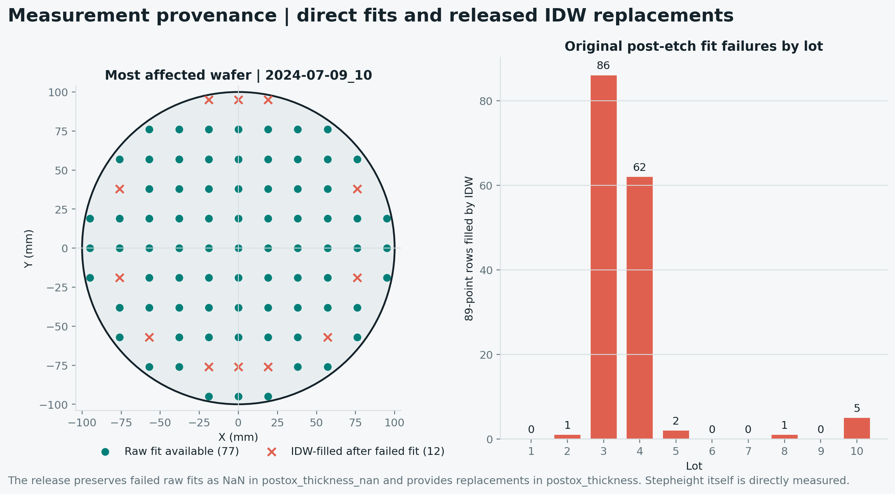
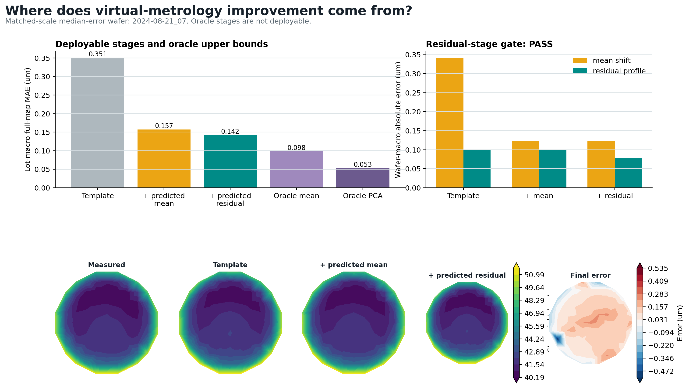
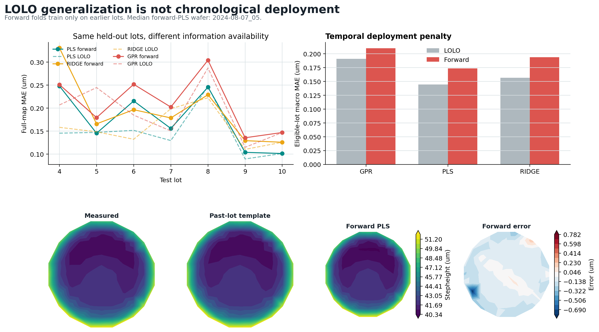
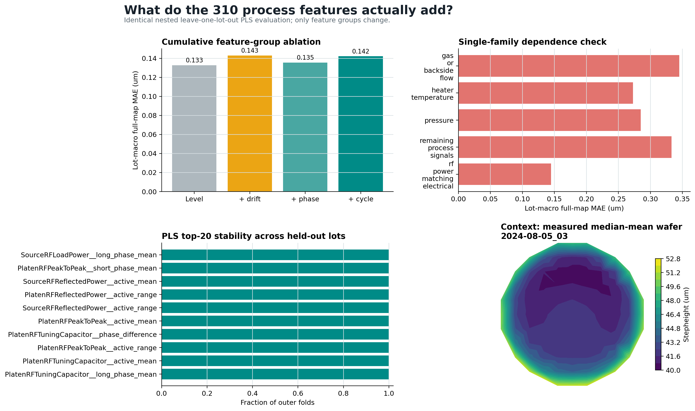
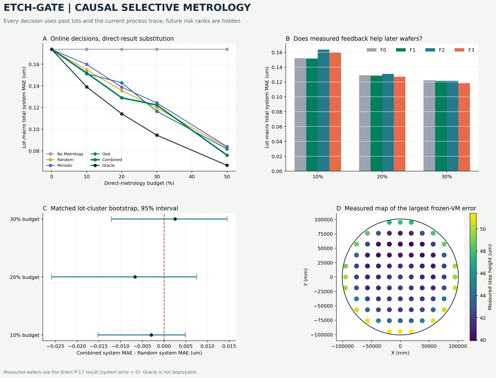

# ETCH-GATE

**Lot-aware virtual metrology and evidence-gated selective measurement for
BOSCH plasma etching**

ETCH-GATE tests whether in-situ equipment traces can predict a directly
measured 89-point wafer stepheight map in a previously unseen process lot, and
whether target-free risk scores can justify routing a limited number of wafers
to direct metrology.

## The Decision Problem

P-17 profilometry provides the spatial result needed to verify an etched wafer,
but it is post-process measurement. Virtual metrology (VM) can estimate the
map from process traces, but a prediction without a production specification,
calibrated uncertainty, or drift validation cannot safely replace measurement.

This repository therefore separates three questions:

1. **Prediction:** how accurately can process traces estimate the 89-point map?
2. **Ranking:** can target-free signals rank likely VM failures?
3. **Deployment:** does a chronological online measurement policy improve the
   complete system under a fixed budget?

Passing an earlier question does not imply passing the next.

## Dataset And Measurement Provenance

The project uses the public 2025 BOSCH deep-silicon-etch release from TU
Chemnitz and Fraunhofer ENAS.

| Released layer | Verified scope | Use here |
| --- | ---: | --- |
| Process traces | 96 wafers, 10 lots, 31 common signals, 5 Hz | VM input |
| Dense P-17 stepheight | 88 wafers x 89 points = 7,832 targets | Primary target |
| OES | 3,648 wavelengths, approximately 25 Hz, four released days | Negative pilot |

The 7,832 rows are not independent samples. They are spatial points nested
inside only 88 labeled wafers. Model splitting and statistical resampling are
therefore performed by lot, not by point or random row.

Stepheight is the direct height difference between protected reference regions
and etched silicon regions. Oxide-derived columns are not used as the primary
target: the released pre-etch oxide surface is largely interpolated from 15
support points, and 157 failed post-etch fits contain released IDW fills.

<p align="center">
  
</p>

Data: [BOSCH plasma-etching dataset](https://doi.org/10.5281/zenodo.17122442).

## What The Model Actually Learns

Cycle validation was run on all 96 process wafers. The selected complementary
phase detector found 99-100 cycles per wafer, with no phase overlap or
unassigned active samples. It does not infer hidden gas chemistry.

Each of the 31 released signal labels is converted into ten summaries:

```text
overall level and variation
early-to-late drift
long/short BOSCH phase means and their contrast
cycle-to-cycle variation and slope
```

This yields 310 candidate features. Filtering, scaling, template fitting,
residual PCA, and model parameter selection are fitted inside training lots
only.

## Template, Mean Shift, And Residual Shape

The measured map is decomposed as:

```text
map = training-lot spatial template
    + wafer-global mean shift
    + zero-mean spatial residual shape
```

The other-lot template explains 98.26% of raw point variance. This does **not**
mean the etch process changes only 1.74%; it means the repeated coordinate
geometry dominates raw-map R2. Raw-map R2 is therefore excluded as a headline
model metric.

| PLS stage | Lot-macro MAE | Meaning |
| --- | ---: | --- |
| Other-lot template | 0.3509 um | No process-dependent wafer correction |
| Predicted mean shift | 0.1574 um | Global wafer offset predicted |
| Predicted mean + residual | **0.1421 um** | Offset and spatial shape predicted |

Residual correction adds a 9.68% gain over mean-shift prediction, improves all
10 lots, and has a lot-cluster bootstrap 95% interval of 7.03%-12.66%. The
residual map is therefore a verified additional contribution, while most of
the total template-to-model gain comes from wafer mean shift.

<p align="center">
  
</p>

## Unseen-Lot Prediction

Ridge, PLS, and GPR use the same direct target, feature table, nested
leave-one-lot-out (LOLO) split, and inner lot-wise tuning.

| Full-map model | Wafer-macro MAE | Lot-macro MAE | Best lots |
| --- | ---: | ---: | ---: |
| Ridge | 0.1555 um | 0.1551 um | 2/10 |
| **PLS** | **0.1459 um** | **0.1421 um** | **8/10** |
| GPR | 0.1703 um | 0.1666 um | 0/10 |

PLS is retained because 88 labeled wafers are small relative to 310 correlated
features, and supervised latent components provide a lower-capacity model than
a deep network. GPR is 16.75% worse than PLS in wafer-macro MAE; its
lot-bootstrap degradation interval is 9.71%-23.22%.

LOLO measures domain generalization when later lots may appear in the training
set. It is not the same as deployment into the future. In a strict
expanding-window test, every training lot precedes the test lot:

| PLS evaluation | Eligible-lot MAE |
| --- | ---: |
| LOLO | 0.1446 um |
| Strict chronological | 0.1737 um |

Forward error is 20.15% higher. The project reports the stronger LOLO result
and the more realistic temporal degradation separately.

<p align="center">
  
</p>

## Feature Ablation And Process Interpretation

The ablation was evaluated on identical outer lots.

| Feature set | Lot-macro full-map MAE |
| --- | ---: |
| Level statistics only | **0.1328 um** |
| Level + temporal drift | 0.1430 um |
| Level + drift + phase | 0.1355 um |
| All features, including cycle behavior | 0.1421 um |

Phase summaries improve the preceding cumulative set by 5.29%, but adding
cycle-behavior summaries then degrades it by 4.91%. Level-only features are a
post-hoc ablation winner, not silently substituted as the preregistered final
model. A future model would need nested feature-group selection before claiming
that improvement as prospective performance.

PLS VIP, coefficient sign, rank, and top-20 recurrence are calculated inside
each outer training fold. Released RF-power, matching, reflected-power, and
pressure labels recur, but association does not identify a hardware fault or
prove process causality.

<p align="center">
  
</p>

## Risk Ranking Versus Causal Routing

The corrected static risk score separates:

```text
initial-state distance from the training PCA centroid
previous-wafer delta, available only after a previous wafer
causal EWMA change, using the configured alpha
OOD distance and Ridge/PLS disagreement
```

For each lot's first wafer, delta and EWMA percentiles are fixed at neutral
0.5. Initial-state distance remains separate. Test targets are used only after
ranking for retrospective scoring.

| Static policy | Lot-macro AURC | Reduction vs Random |
| --- | ---: | ---: |
| Random | 0.1419 | - |
| OOD | 0.1328 | 6.44% |
| Disagreement | 0.1321 | 6.93% |
| Equal-weight combined | **0.1287** | **9.28%** |
| Training-weighted candidate | 0.1406 | 0.95% |

The combined score improves 8/10 lots, but its bootstrap interval for
policy-minus-Random AURC is `[-0.0310, 0.0017]`; the preregistered 10% gate
fails. Removing Lot 8 preserves only a 4.76% reduction. Training-only learned
weights are rejected because they are unstable and worse than equal weighting.

The causal replay then processes Lots 4-10 in wafer order. It cannot sort
future risk scores. Selected wafers use direct P-17 results; F1-F3 feedback
updates may affect only later wafers.

| Direct-metrology budget | Combined system-MAE change vs Random |
| ---: | ---: |
| 10% | 1.89% better |
| 20% | 4.94% better |
| 30% | 2.12% worse |

Only 3/7, 3/7, and 2/7 test lots beat Random at those budgets. All bootstrap
intervals cross zero, and excluding Lot 8 reverses the average direction. F1
scalar-bias feedback averages a small 0.97% gain over frozen VM; more complex
refits do not improve the overall mean. The causal policy gate is **FAIL**, so
adaptive selective metrology is not claimed as the final contribution.

<p align="center">
  
</p>

## Negative Results: Uncertainty And OES

Raw GPR variance is not calibrated uncertainty. Its point-wise nominal 95%
coverage is 88.80%, and its wafer-error Spearman correlation is 0.223.
Group-aware split conformal evaluation also fails:

| Nominal | Point coverage | Simultaneous map coverage | Mean map-interval width |
| ---: | ---: | ---: | ---: |
| 80% | 78.16% | 87.86% | 3.10 um |
| 90% | 88.87% | 98.57% | 10.28 um |
| 95% | 88.87% | 98.57% | 10.28 um |

Only 6-10 calibration wafers are available. A 95% finite-sample conformal
quantile is unattainable in every evaluated lot; simultaneous intervals become
too wide to be useful. Uncertainty is excluded from routing.

OES incremental-value pilot:

- raw cycle/phase statistics fusion failed;
- compact normalized OES mean-shift modeling also failed;
- OES was excluded from the final stepheight VM model.

The compact OES design produced 0.4142 um lot-macro MAE versus 0.3387 um for
process-only PLS on the same four pilot lots, improving only 1/4 lots. This does
not establish an OES chemical mechanism or endpoint detector.

<p align="center">
  
</p>

## Leakage Prevention

The automated protocol enforces:

```text
outer test lots excluded from scaling, PCA, templates, and tuning
chronological training lot number strictly below test lot number
calibration lot strictly between fit lots and test lot
future process features excluded from current preprocessing
future metrology targets excluded from current risk, decision, prediction,
and feedback state
lot-cluster bootstrap instead of point-row resampling
```

Perturbation tests add 1,000 um to held-out or future targets and verify that
predictions, intervals, and earlier causal decisions do not change.

## Reproduction

Python 3.10 and 3.11 are tested in CI. Raw BOSCH files are not committed.

```bash
python -m pip install -r requirements.txt
python -m pip install -e .
python scripts/verify_claims.py
python scripts/run_full_reproduction.py \
  --data-dir data/bosch_raw \
  --output-root results/reproduction \
  --figure-root docs/figures
python -m ruff check .
python -m pytest -q
```

Detailed result reports:

The claim audit runs from the committed result artifacts without downloading raw
data. Full reproduction writes and audits its own new result directory; the
separate OES pilot is not part of that eleven-stage process-only run. Cached
steps are invalidated by code, configuration, input, or result-file changes.

- [Cycle validation](docs/CYCLE_VALIDATION_RESULTS.md)
- [Feature ablation](docs/FEATURE_ABLATION_RESULTS.md)
- [Spatial decomposition](docs/SPATIAL_DECOMPOSITION_RESULTS.md)
- [Chronological VM](docs/CHRONOLOGICAL_VM_RESULTS.md)
- [Risk robustness](docs/RISK_ROBUSTNESS_RESULTS.md)
- [Causal replay](docs/CAUSAL_SELECTIVE_METROLOGY_RESULTS.md)
- [Uncertainty calibration](docs/UNCERTAINTY_CALIBRATION_RESULTS.md)

## Limitations

1. The dense target contains 88 wafers, not high-volume fab history.
2. No specification limit, yield, cycle-time cost, chamber-maintenance label,
   or gauge R&R study is released.
3. Direct measurement is treated as error-free in replay; real metrology has
   uncertainty and delay.
4. Lot, date, conditioning, and unobserved maintenance can be confounded.
5. The public labels support association and prediction, not root-cause proof.
6. P-17 and Dektak results are not traceable physical calibration without a
   cross-tool measurement study.

## Allowed And Forbidden Claims

**Supported**

- Process traces reduce unseen-lot PLS map MAE relative to an other-lot
  coordinate template.
- Residual-shape correction adds a verified 9.68% lot-macro gain after mean
  shift prediction.
- Strict chronological performance is materially worse than LOLO.
- Static risk ranking shows limited retrospective value but fails its 10% gate.
- Causal routing, conformal uncertainty, and OES incremental value fail their
  current gates.

**Not supported**

- production-ready VM or guaranteed wafer disposition;
- calibrated uncertainty or validated OOC control limits;
- adaptive metrology superiority;
- OES-based endpoint detection or chemical mechanism identification;
- hardware-fault diagnosis, causal process explanation, or production cost
  savings.

## References

- [BOSCH plasma-etching dataset](https://doi.org/10.5281/zenodo.17122442)
- [NIST online VM and dynamic sampling study](https://www.nist.gov/publications/comparative-study-semiconductor-virtual-metrology-methods-and-novel-algorithmic)
- [Fraunhofer ENAS plasma diagnostics and OES](https://www.enas.fraunhofer.de/en/departments/NDT/forschungsschwerpunkte/prozesse_und_materialien/plasmadiagnostik.html)
- [scikit-learn PLS documentation](https://scikit-learn.org/stable/modules/cross_decomposition.html)
