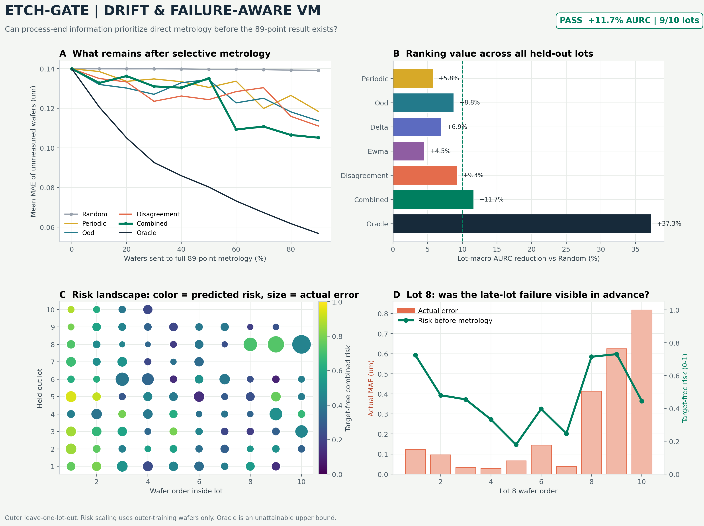

# Milestone 4 - Drift and Failure-Risk Results

## Question

Can information available when a wafer finishes processing identify unreliable
PLS virtual-metrology predictions before its 89-point stepheight is measured?

## Risk Proxies

All scores are constructed inside each outer leave-one-lot-out fold.

- `OOD`: nearest-training-wafer distance in a training-fitted 10-component PCA
  representation of the 310 process summaries;
- `delta`: distance from the preceding wafer inside the same ordered lot;
- `EWMA`: distance from the causally updated process-feature average;
- `disagreement`: 89-point RMSE between Ridge and PLS predictions;
- `combined`: equal mean of the four outer-training empirical percentiles.

The combined score has no target-fitted coefficient. Model disagreement is a
risk proxy, not calibrated uncertainty. EWMA is a relative change score, not a
production out-of-control limit.

## Preregistered Result

The primary metric is area under the retained-risk curve (AURC). At each full
metrology fraction, high-score wafers are removed and the mean PLS MAE of the
remaining, unmeasured wafers is calculated. Lower is better.

| Policy | Lot-macro AURC | Reduction vs Random |
|---|---:|---:|
| Random, 10,000 repeats | 0.13968 | - |
| Periodic | 0.13162 | 5.8% |
| OOD | 0.12742 | 8.8% |
| Delta | 0.13000 | 6.9% |
| EWMA | 0.13334 | 4.5% |
| Ridge/PLS disagreement | 0.12672 | 9.3% |
| Equal-weight combined | **0.12340** | **11.7%** |
| True-error oracle | 0.08762 | 37.3% |

The combined policy passes the frozen gate of at least 10% AURC reduction and
improves nine of ten held-out lots. Lot 10 is the exception, with 24.2% worse
AURC than Random; it contains only four dense wafers.

## Important Low-Budget Limitation

The aggregate pass is driven partly by moderate and high metrology fractions.
At practically interesting low fractions, the combined policy is only modestly
better than Random:

| Requested full-metrology fraction | Combined reduction | OOD-only reduction |
|---:|---:|---:|
| 10% | 5.1% | 5.6% |
| 20% | 2.6% | 6.9% |
| 30% | 6.3% | 9.2% |

Therefore Milestone 4 establishes ranking signal, not a finished low-budget
sampling policy. OOD is the stronger simple choice in the 10%-30% region. No
post-hoc reweighting is performed.

## Post-Selection Handling

Selection currently reveals the already released 89-point P-17 result and
removes that wafer from retained-risk scoring. The measurement is not fed back
to PLS, does not recalibrate the score, and does not alter predictions for later
wafers. The experiment therefore measures ranking quality, not the benefit of
an online metrology-feedback loop. A later causal comparison must separate
measurement substitution from model updating and may use only measurements
available earlier in wafer order.

## Leakage Audit

- Constant removal, scaling, PCA, reference score distributions, map template,
  residual PCA, Ridge, and PLS are fitted without the held-out lot.
- Sequential scores use only the current and preceding process features within
  the ordered lot.
- Held-out stepheight is used only after ranking to calculate retrospective
  retained risk.
- An automated test adds 1,000 um to a held-out lot's target and verifies that
  every target-free score remains unchanged.

## Allowed Claim

On this 88-wafer research dataset, a preregistered target-free combination of
process drift, OOD, and model-disagreement proxies improves retrospective
failure ranking over Random across unseen lots. It does not establish calibrated
uncertainty, a fab control limit, production cost savings, or reliable
low-budget deployment.
