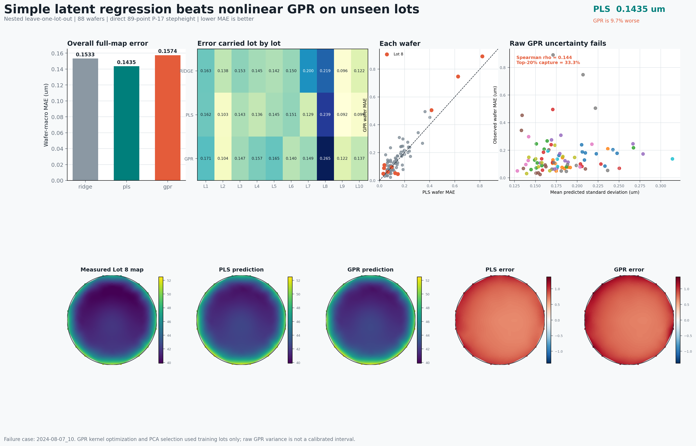

# Process-Model Benchmark

## Question

Does nonlinear Gaussian-process regression improve unseen-lot 89-point
stepheight prediction over Ridge and PLS, and can its raw predictive standard
deviation identify high-error wafers?

## Controlled Comparison

Every model uses the same 88 wafers, 310 cycle-aware process features, direct
P-17 stepheight target, coordinate template, map decomposition, outer
leave-one-lot-out folds, and inner leave-one-lot-out tuning. Constant removal,
standardization, input PCA, residual-map PCA, model fitting, and model selection
are repeated using outer-training lots only.

The GPR path performs three additional operations:

1. Fit whitened input PCA using only the current training wafers.
2. Select 4, 8, or 16 input components by inner lot-wise validation.
3. Fit a Constant-RBF-White kernel and optimize kernel parameters using only
   the current training fold.

The first fixed-kernel pilot was not accepted because the mean-shift model
repeatedly selected the largest tested length scale. The final comparison uses
training-fold marginal-likelihood kernel optimization so the result is not an
artifact of that narrow search boundary.

## Accuracy

| Model | Wafer-macro MAE | Wafer-macro RMSE | Wafer-mean RMSE | Best lots |
|---|---:|---:|---:|---:|
| Ridge | 0.1533 um | 0.2089 um | 0.1806 um | 2/10 |
| **PLS** | **0.1435 um** | **0.1976 um** | **0.1733 um** | **7/10** |
| GPR | 0.1574 um | 0.2184 um | 0.1994 um | 1/10 |

GPR increases MAE by 9.7% relative to PLS. A paired lot-cluster bootstrap with
10,000 repeats gives a 95% interval of +3.6% to +16.1%. PLS has lower lot MAE
than GPR in nine of ten held-out lots. GPR wins only Lot 6 and does not repair
Lot 8: Lot 8 MAE is 0.2650 um for GPR, 0.2393 um for PLS, and 0.2191 um for
Ridge.

## Raw GPR Uncertainty Audit

GPR variance is evaluated as an uncalibrated proxy, not presented as a valid
confidence interval.

| Audit | Result |
|---|---:|
| Wafer mean standard deviation vs wafer MAE Spearman rho | 0.144 |
| Spearman p-value | 0.181 |
| Capture of top-20% error wafers by top-20% uncertainty | 33.3% |
| Raw nominal 95% point-wise coverage | 88.5% |
| Mean point-wise predicted standard deviation | 0.1828 um |

The weak, non-significant rank correlation and low high-error capture reject
raw GPR standard deviation for selective-metrology routing. The 88.5% coverage
also misses the nominal 95% target. No post-hoc scaling is fitted on test lots.



## Decision

PLS remains the frozen process-only baseline. GPR is retained as a documented
negative result and is not carried into the primary OES comparison. The next
experiment must test whether training-fold-only OES compression adds unseen-lot
information beyond PLS, with the same target, split, and metrics.

Reproduce the statistical audit and figure with:

```bash
python scripts/analyze_model_benchmark.py \
  --result-dir results/process_model_benchmark \
  --figure-path docs/figures/model_benchmark/model-benchmark-dashboard.png
```
