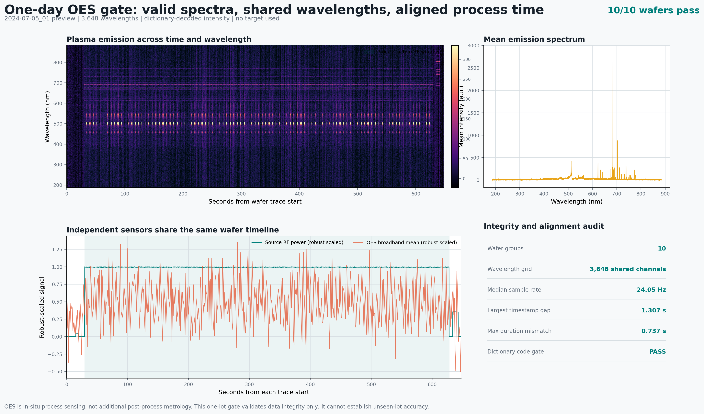

# One-Day OES Integrity And Alignment Gate

## Role Of OES

OES measures plasma-emission intensity in situ while the Bosch recipe is
running. It is an additional sensor modality, not an additional post-process
wafer measurement. The P-17 89-point stepheight map remains the direct
metrology label revealed after processing.

This distinction affects the later cost model:

- OES can have equipment, integration, calibration, and maintenance cost;
- an already equipped etcher records OES without a separate wafer-routing step;
- P-17 measurement consumes post-process metrology capacity and is the resource
  controlled by the selective-metrology policy.

## Verified File

The representative file is `Day_2024_07_05.nc`, corresponding to Lot 2.

| Item | Verified result |
|---|---:|
| File size | 833,563,333 bytes |
| Official MD5 | `fe2a0432b433daf0bdf9745b877b879b` |
| Wafer groups | 10 |
| Wafers with direct 89-point target | 10 |
| Time samples per wafer | 13,871-15,378 |
| Wavelength channels | 3,648 |
| Wavelength range | 185.891-883.967 nm |
| Median effective sampling rate | 24.05 Hz |
| Maximum timestamp gap | 1.307 s |
| Maximum OES/process duration mismatch | 0.737 s |
| Integrity result | 10/10 pass |

The nominal acquisition is described as 25 Hz. Actual timestamps are retained
and show a median near 24 Hz plus irregular gaps, so row numbers are never
treated as exact time.



## Feature Feasibility

`extract_oes_feature_table` decodes `uint16` dictionary indices in time chunks
and aligns each OES sample to the nearest process-sensor timestamp after both
traces are expressed as seconds from wafer start. It calculates seven summaries
for every wavelength:

1. active-process mean;
2. active-process standard deviation;
3. late 10% minus early 10% intensity;
4. long Bosch-phase mean;
5. short Bosch-phase mean;
6. long-minus-short phase difference;
7. slope of the wavelength's cycle mean over approximately 100 cycles.

This produces `3,648 x 7 = 25,536` candidate values per wafer. Ten wafers were
processed in 19.9 seconds on the local CPU. The extraction is target-free and
does not select wavelengths. Scaling, wavelength selection, PCA, and PLS remain
training-fold-only operations in the later model.

## Claim Boundary And Next Gate

Lot 2 alone cannot test unseen-lot improvement. No correlation with stepheight,
feature ranking, model accuracy, or 5% improvement is reported from this gate.

The preregistered pilot uses Lots 2, 4, 6, and 9, selected to span chronology
before observing an OES model result. Process+OES must reduce lot-macro
full-map MAE by at least 5% and improve at least three of four lots before the
remaining daily files are retained for the primary model. Passing four lots is
only a download gate, not final evidence across all ten lots.

## Reproduce

```bash
python scripts/audit_oes_pilot.py \
  --data-dir data/bosch_raw \
  --oes-file Day_2024_07_05.nc \
  --output-dir results/oes_one_day_gate \
  --figure-path docs/figures/oes/oes-one-day-gate.png

python scripts/extract_oes_features.py \
  --data-dir data/bosch_raw \
  --oes-files Day_2024_07_05.nc \
  --output-dir results/oes_feature_pilot
```
