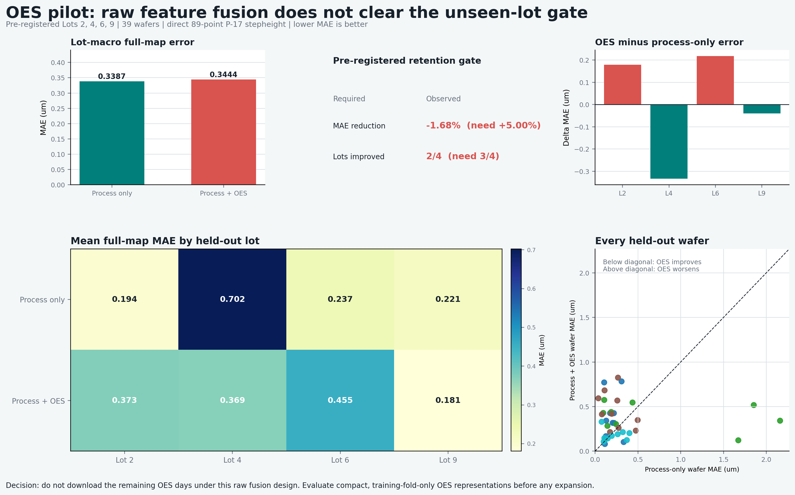

# Four-Lot OES Incremental-Value Pilot

## Decision

**Do not expand the raw OES download under the current feature-fusion design.**

The pilot was preregistered before fitting an OES model: hold out each of Lots
2, 4, 6, and 9 in turn; compare the frozen PLS process-only baseline with the
same leakage-safe workflow plus OES features; retain OES only when it reduces
lot-macro full-map MAE by at least 5% and improves at least three of the four
held-out lots.

## Result

| Evaluation quantity | Process-only PLS | Process + OES PLS |
|---|---:|---:|
| Dense wafers | 39 | 39 |
| Candidate input features | 310 | 25,846 |
| Lot-macro full-map MAE | 0.3387 um | 0.3444 um |

The relative MAE reduction is **-1.68%**: adding OES worsened the average
unseen-lot error. Only **2/4** held-out lots improved. The retention gate
therefore fails on both requirements.

<p align="center">
  
</p>

## What was compared

For each held-out lot, all wafers in that lot were absent from fitting,
normalization, variance filtering, and inner parameter selection. Both arms use
the same direct 89-point P-17 stepheight target, the same outer lots, and the
same nested PLS search. The only difference is the input:

```text
Process only:     310 target-free process summaries
Process + OES:    those 310 summaries + 25,536 OES summaries
```

Each OES wavelength contributes seven target-free summaries: active mean,
active standard deviation, early-to-late change, long-phase mean, short-phase
mean, phase difference, and cycle-mean slope. The summaries are aligned to
recorded timestamps and Bosch phases, rather than assuming an exact sample rate.

## Interpretation and boundary

This is not evidence that OES is intrinsically unhelpful for etch VM. It is
evidence that this high-dimensional raw-statistics fusion does not generalize
with 39 pilot wafers. The observed degradation is consistent with an unstable
representation-to-sample-size ratio. No remaining OES days will be downloaded
to make this design look better.

The next defensible research decision is to pre-register a **compact OES
representation** (for example, a fixed physics-window representation or
training-fold-only supervised wavelength selection) and test it against this
failed raw-fusion baseline before expanding data volume.

## Reproduce

```powershell
$env:PYTHONPATH='src'
.\.venv\Scripts\python.exe scripts\extract_oes_features.py `
  --data-dir data\bosch_raw `
  --oes-files Day_2024_07_05.nc Day_2024_07_11.nc Day_2024_08_01.nc Day_2024_08_21.nc `
  --output-dir results\oes_four_lot_features

.\.venv\Scripts\python.exe scripts\run_oes_pilot.py `
  --data-dir data\bosch_raw `
  --oes-features results\oes_four_lot_features\oes_features.csv `
  --config configs\analysis\oes_pilot.json `
  --output-dir results\oes_four_lot_pilot
```
