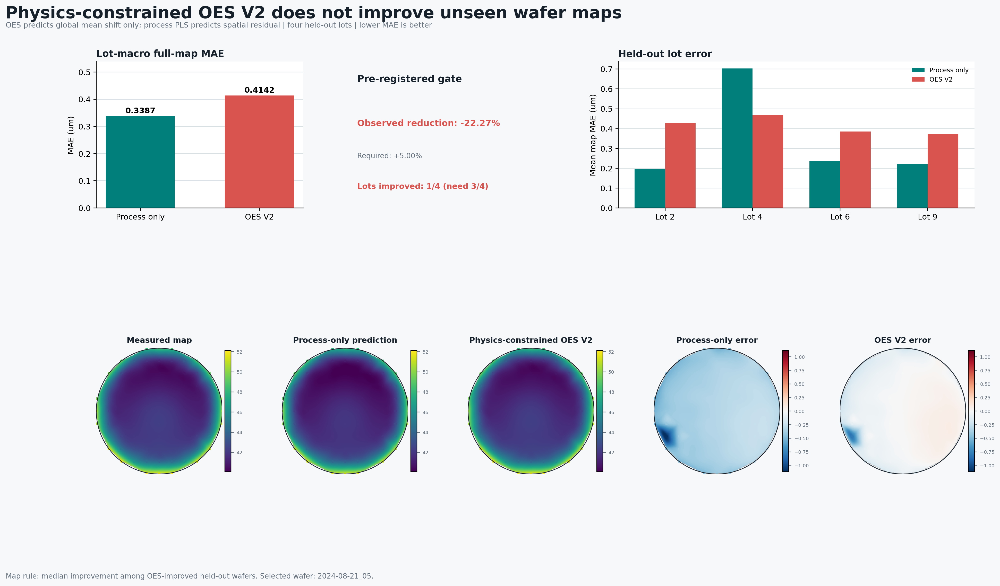

# Physics-Constrained OES V2 Result

## Fixed hypothesis

V1 allowed OES features to predict both the wafer-global mean shift and the
89-point spatial residual. V2 tested a narrower physical hypothesis:

```text
Normalized compact OES -> wafer-global stepheight mean shift
Process-only PLS       -> wafer-map spatial residual
```

Each OES spectrum was divided by its broadband intensity, then summarized by
active, early, late, long-phase, short-phase, and cycle-slope spectral shape.
PCA rank (2, 4, or 8) and Ridge penalty were selected only in inner training
lots. The held-out lot was excluded from normalization, PCA, model fitting, and
parameter selection.

## Result

| Model | Lot-macro full-map MAE |
|---|---:|
| Process-only PLS | 0.3387 um |
| Physics-constrained OES V2 | 0.4142 um |

V2 changed MAE by **-22.27%** (worse) and improved only **1/4** held-out lots.
It fails the unchanged gate of at least 5% improvement in at least 3/4 lots.

<p align="center">
  
</p>

## What the wafer maps show

The dashboard follows the deterministic rule specified before fitting: select
the median improvement among OES-improved held-out wafers. It presents measured
stepheight, process-only prediction, V2 prediction, and matched-scale error
maps. The image does not rescue the aggregate result: the global OES correction
is not stable across lots.

## Decision

Do not download the remaining OES days for this project. Both a broad raw
feature fusion and a compact, physically constrained mean-shift model failed
the same unseen-lot gate. The defensible outcome is that the public dataset's
available OES signal has not demonstrated additive value for this 89-point
stepheight-map target under the stated evaluation protocol.

This does not prove that OES is generally useless in plasma etching. It bounds
the project claim to this target, dataset, representation, and lot-aware split.
