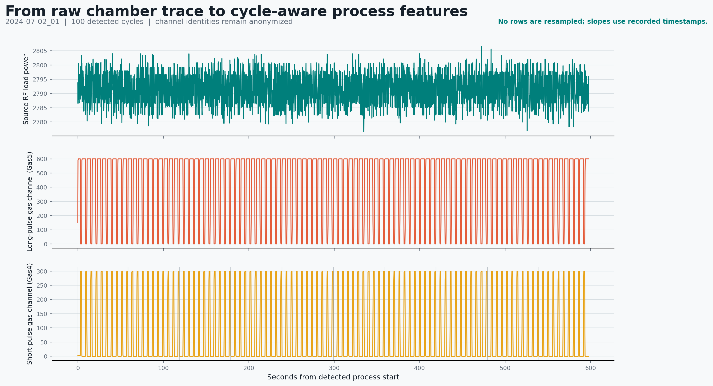
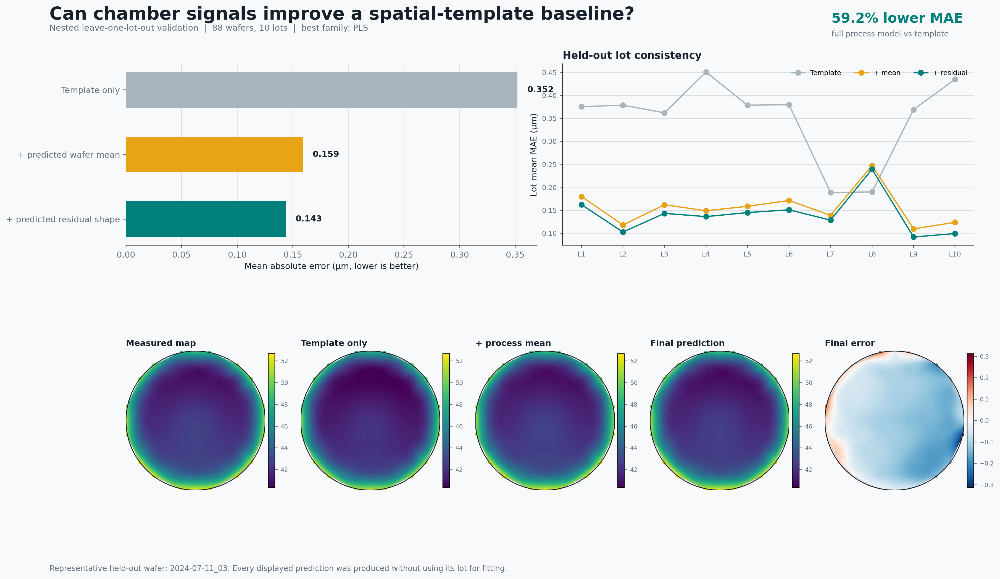
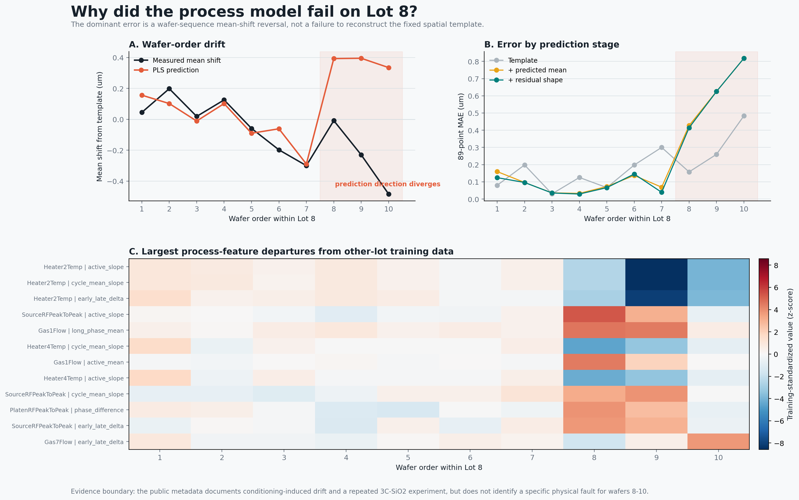

# Milestone 3: Process-Only Baseline

## Question

Can the 31 common chamber signals predict held-out-lot stepheight better than a
spatial template fitted to the other nine lots?

## Process Representation

Each wafer contains about 600 seconds of 5 Hz process data. The code detects
the source-RF active window and the repeating long- and short-pulse gas phases.
The public channel names are anonymous, so Gas4 and Gas5 are not assigned
unsupported chemical identities.

Ten summaries are calculated for each of the 31 common signals:

1. active-window mean;
2. active-window standard deviation;
3. 5th-to-95th percentile range;
4. timestamp-aware active-window slope;
5. final-10% minus initial-10% mean;
6. long-phase mean;
7. short-phase mean;
8. long-minus-short phase difference;
9. cycle-mean standard deviation;
10. cycle-mean slope.

This creates 310 candidate features per wafer. Constant removal and
standardization are fitted again inside every training fold. The final outer
folds retain 241 non-constant features. The largest timestamp gap inside any
detected active process window is 0.21 seconds; no active trace is resampled.

## Leakage Controls

The outer split hides one complete lot. Within the remaining nine lots, a
second leave-one-lot-out loop chooses Ridge regularization or the number of PLS
components. The following objects are fitted using training lots only:

- constant-feature mask;
- feature means and standard deviations;
- coordinate template;
- residual-map PCA basis;
- model hyperparameters and coefficients.

The held-out lot is used only once for final scoring.

## Models

`Ridge` is a linear model that shrinks unstable coefficients. `PLS` constructs
a few process-feature combinations that are selected for their relationship
to the target. Both models separately predict:

1. the wafer-wide mean shift from the other-lot template;
2. up to eight PCA scores describing the remaining local residual shape.

The residual PCA retained three components in every outer fold. This does not
mean three process variables were selected; it means the 89-point residual map
was represented using three learned spatial shape patterns.

## Results

| Model | Stage | Wafer mean MAE (um) | Lot-macro MAE (um) |
|---|---|---:|---:|
| PLS | template only | 0.3520 | 0.3509 |
| PLS | predicted mean shift | 0.1591 | 0.1559 |
| PLS | predicted mean + residual | **0.1435** | **0.1399** |
| Ridge | predicted mean + residual | 0.1533 | 0.1528 |

PLS lowers wafer-mean MAE by 59.2% relative to the strict other-lot template.
The lot-cluster bootstrap 95% interval is 43.8%-68.3%. The full PLS model
improves over the template in nine of ten held-out lots and improves over the
mean-only stage in all ten. Lot 8 is the exception against the template:
its lot-mean MAE increases from 0.1899 to 0.2393 um.

## Lot 8 Failure Analysis

Lot 8 is the only held-out lot where the full PLS model is worse than the
template. Wafers 1-7 generally preserve the measured direction of wafer-mean
drift. At wafers 8-10, the measured mean shifts are -0.009, -0.230, and
-0.484 um, while PLS predicts +0.393, +0.395, and +0.335 um.

Several process summaries change sharply in the final three wafers, including
Source-RF peak-to-peak slope, Heater2 temperature drift, Gas1 mean, and Gas7
drift. The wafers are not beyond the training 95th percentile under a global
PCA nearest-neighbor distance, so a simple global OOD threshold would not
fully explain or catch this failure.

The source README states that lots were processed sequentially without
intermediate cleaning to induce chamber-state drift. Lot 7 and Lot 8 share the
3C-SiO2 condition, and this experiment was repeated after etching-tool
problems. It does not identify a specific physical failure for Lot 8 wafers
8-10. The defensible conclusion is an observed late-lot regime change, not a
proven hardware-fault mechanism.

## What This Result Does Not Prove

- It does not prove causal control of etch depth.
- It does not establish production OOS detection or yield improvement.
- It does not identify the physical chemistry of anonymous channels.
- It does not show that OES is unnecessary.
- It does not yet provide calibrated uncertainty or a metrology escalation
  policy.

## Important Functions

- `load_process_traces`: converts NetCDF dictionary codes into real numerical
  process values and keeps only signals shared by every wafer.
- `detect_process_regions`: finds the RF-active interval and repeating pulse
  boundaries using recorded timestamps.
- `extract_trace_features`: converts a long trace into 310 wafer-level
  summaries.
- `prepare_feature_transform`: removes training-fold constants and standardizes
  scales without seeing the test lot.
- `fit_residual_basis`: compresses the 89-point leftover shape using
  training-only PCA.
- `evaluate_process_baselines`: performs nested leave-one-lot-out tuning,
  prediction, and scoring for every held-out lot.

## Decision Gate

Milestone 3 passes: process signals provide a large, consistent improvement
over the spatial template. The next project milestone is drift and
failure-aware VM focused on Lot 8. Real 9-point Dektak and later 89-point P-17
measurements are not fused because no same-time tool-matching or reference
study is available. One-day OES remains deferred until the process failure
signals are characterized.
