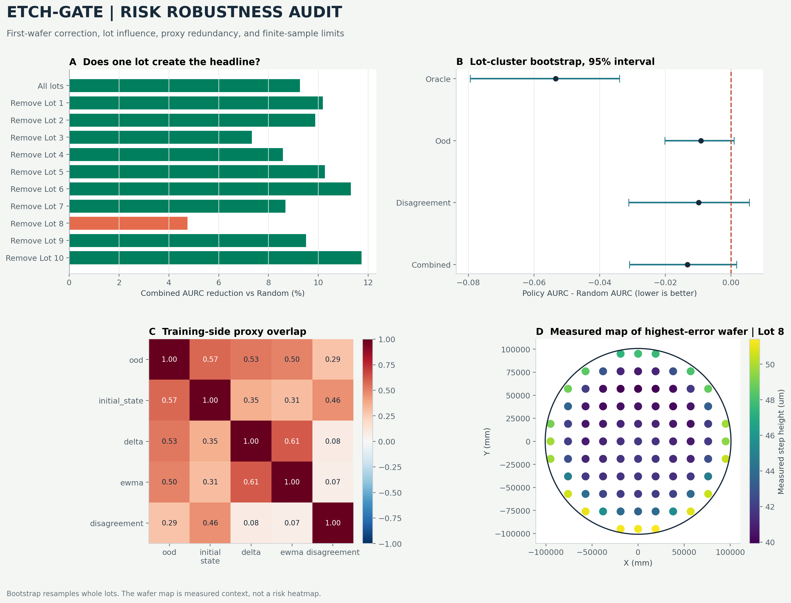

# Drift-Risk and Robustness Results

## What was corrected

The former sequential score compared each lot's first wafer with a zero
vector. That value was neither a previous-wafer change nor a causal EWMA
change. The revised rule is fixed in `configs/analysis/drift_risk.json`:

- first-wafer delta percentile: 0.5;
- first-wafer EWMA percentile: 0.5;
- initial-state distance: separate distance from the outer-training PCA
  centroid;
- EWMA alpha: preregistered 0.3, with 0.1 and 0.5 reported only as
  sensitivity analyses.

The calculation is target-free. Held-out metrology is used only to score how
well each ranking would have worked retrospectively.

## Static ranking result

| Policy | Lot-macro AURC | Reduction vs Random |
| --- | ---: | ---: |
| Random | 0.1419 | 0.00% |
| OOD | 0.1328 | 6.44% |
| Disagreement | 0.1321 | 6.93% |
| Equal-weight combined | 0.1287 | 9.28% |
| Training-weighted candidate | 0.1406 | 0.95% |
| Oracle | 0.0887 | 37.51% |

Lower AURC is better. The equal-weight combination improved 8 of 10 held-out
lots. Its matched policy-minus-Random difference was -0.01316, with a
lot-cluster bootstrap 95% interval of [-0.03097, 0.00172] and a 95.47%
bootstrap probability of beating Random. The preregistered 10% AURC reduction
gate therefore failed.

This result establishes ranking value, not calibrated uncertainty and not an
online deployment benefit.

## Lot influence

Removing Lot 8 reduced the combined improvement from 9.28% to 4.76%, but the
direction remained favorable. Two lots were worse than Random both with and
without Lot 8. The static result is therefore influenced by Lot 8 but is not
created solely by Lot 8.

Lot 10 contains four wafers. It permits only 24 complete ranking permutations.
Budgets 0%, 10%, 20%, 30%, 40%, 50%, 60%, 70%, 80%, and 90% round to selected
counts 0, 0, 1, 1, 2, 2, 2, 3, 3, and 3. Lot 10 cannot be interpreted with the
same resolution as ten-wafer lots.

## Proxy overlap and EWMA sensitivity

The outer-training mean Spearman correlation between OOD and initial-state
distance was 0.572, below the preregistered redundancy threshold of 0.90.
Both were therefore retained in the equal-weight score. Delta and EWMA had a
mean training correlation of 0.611.

Against preregistered alpha 0.3, the mean test-lot EWMA rank correlations were
0.711 for alpha 0.1 and 0.909 for alpha 0.5. This sensitivity confirms that
alpha changes the ranking; no test outcome was used to select alpha.

## Training-only weight selection

A non-negative 0.25-step simplex grid was optimized by inner leave-one-lot-out
validation. The candidate had to improve inner macro AURC by at least 2% and
be no worse in at least 70% of inner lots. Only 2 of 10 outer folds satisfied
that stability rule. The candidate also underperformed equal weighting on the
outer test lots (0.1406 vs 0.1287 AURC).

The learned weighting is rejected. Equal weighting remains the final static
ranking policy because it is simpler and more stable.

