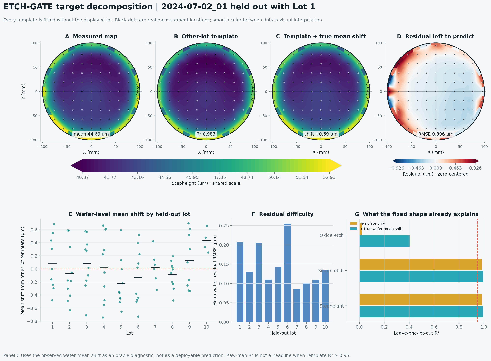

# Milestone 2 - Lot-Aware Target and Template Results

## Question

Can a model obtain a high 89-point map score by memorizing a spatial pattern
that repeats across wafers, without learning process-dependent wafer changes?

## Decomposition

For wafer `w` and measurement position `p`, the analysis writes:

```text
Y(w,p) = T_train(p) + M(w) + R(w,p)
```

- `Y(w,p)`: released measurement;
- `T_train(p)`: coordinate mean fitted without the held-out lot;
- `M(w)`: observed wafer mean offset from that template;
- `R(w,p)`: remaining local residual after removing template and mean shift.

`M(w)` is calculated from the held-out target only as an oracle diagnostic. It
is not available to a deployable virtual-metrology model. Milestone 3 must
predict mean shift from process traces without seeing metrology.

## Leakage Control

Each of the ten lots is held out once. Its measurements do not fit its template,
normalization, threshold, or target transformation. All 89 rows from one wafer
remain together. A test changes a held-out lot's target by a large constant and
confirms that its template prediction does not change.

## Results

| Target | Template R2 | Template MAE | True-mean-shift oracle R2 | Oracle MAE |
|---|---:|---:|---:|---:|
| Stepheight | 0.9826 | 0.3520 µm | 0.9948 | 0.0991 µm |
| Silicon etch | 0.9820 | 0.3589 µm | 0.9945 | 0.1131 µm |
| Oxide etch | 0.0221 | 0.0529 µm | 0.4053 | 0.0499 µm |

Stepheight and silicon-etch raw maps are template-dominant under the
preregistered `R2 >= 0.95` gate. Their raw-map R2 values are excluded from
future headline model claims. The process-only model must instead report:

- wafer mean-shift error;
- residual-profile error;
- lot-macro metrics;
- improvement over the other-lot template.

Oxide etch is not template-dominant and is potentially more process-sensitive.
It remains secondary because dense pre-etch oxide values are mostly IDW
reconstructions from 15 measurements and 157 failed post-etch fits are replaced
in the released filled column.

## Visual Evidence



Panel C uses the true held-out wafer mean and is therefore an oracle diagnostic.
Black dots are the released 89 measurement locations. Smooth color between
points is visual interpolation only.


The provenance view distinguishes raw post-etch fits from locations where the
release supplied an IDW replacement. Stepheight itself is a direct profilometer
measurement.

## Reproduce

```powershell
python scripts/analyze_etch_targets.py `
  --data data/bosch_raw/Si_Oxide_etch_89_points.csv `
  --config configs/analysis/etch_target_template.json `
  --output-dir outputs/target_template `
  --figure-dir docs/figures/target_template
```

Machine-readable outputs:

- `manifest.json`: source hash, configuration, metrics, and claim boundaries;
- `point_decomposition.csv`: every point's observed value and decomposition;
- `wafer_summary.csv`: wafer mean shift and residual errors;
- `lot_summary.csv`: lot-level residual and shift summaries.
