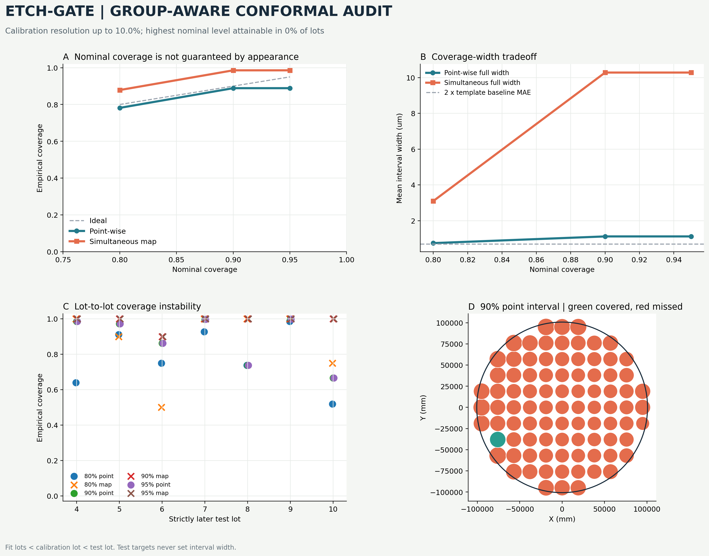

# Uncertainty Calibration Results

For each outer test lot, the immediately preceding lot is calibration-only
and all earlier lots fit the VM. Test targets never determine interval width.

| Nominal | Point coverage | Simultaneous map coverage | Point width (um) | Map width (um) | Attainable lots |
| ---: | ---: | ---: | ---: | ---: | ---: |
| 80% | 78.16% | 87.86% | 0.7458 | 3.0957 | 100% |
| 90% | 88.87% | 98.57% | 1.1199 | 10.2805 | 86% |
| 95% | 88.87% | 98.57% | 1.1199 | 10.2805 | 0% |

Overall gate: **FAIL**

| Gate check | Result |
| --- | --- |
| coverage within tolerance | FAIL |
| half width below template baseline mae | FAIL |
| stable across lots | FAIL |
| requested levels attainable | FAIL |

A failed gate stops any claim that raw GPR variance or these conformal
intervals are calibrated enough for selective-metrology routing.

